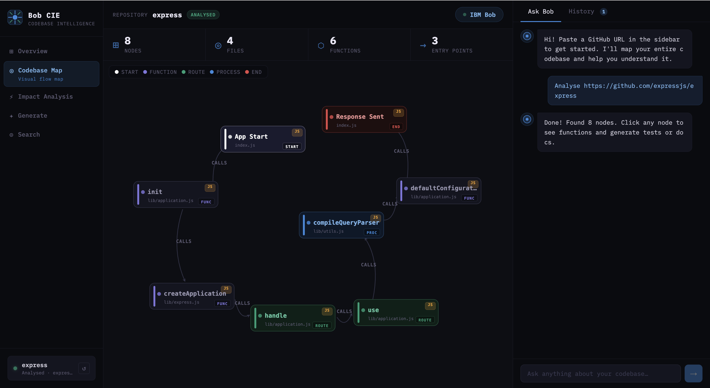
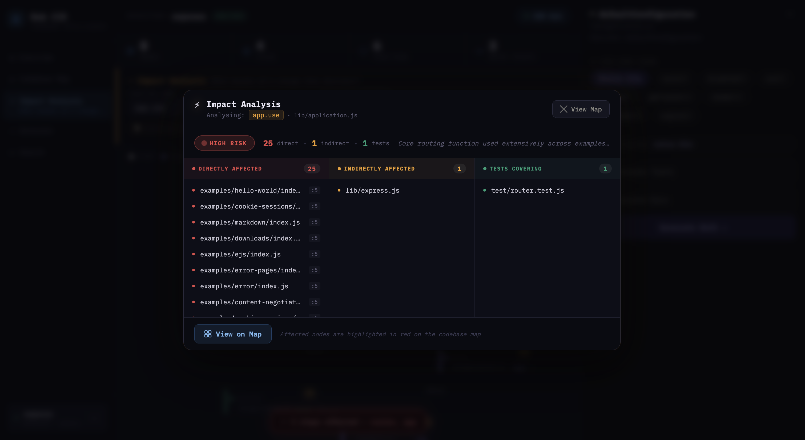
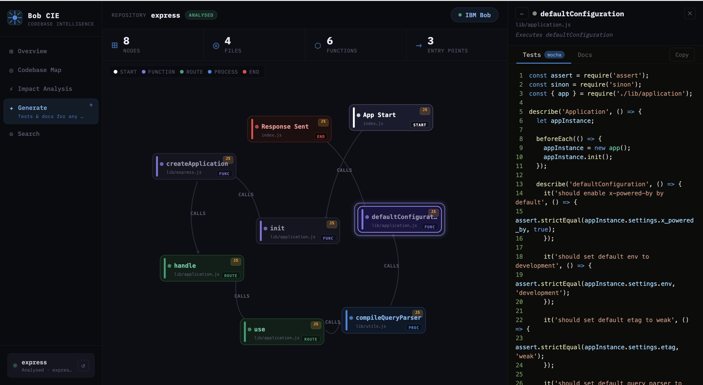

# CIE — Codebase Intelligence Engine
> Powered by IBM Bob | IBM Bob Dev Day Hackathon 2025


### Understand any codebase in minutes. Not days.

---

## The Problem

Every developer has been here:

- 🤯 Join a new repo — no idea where anything lives
- 💥 Change a function — no idea what will break
- 📄 Blank test files — no idea where to start
- 📚 Stale documentation — no idea what's still accurate

These problems waste hours every day, at every skill level.

---

## The Solution

CIE is a codebase intelligence tool powered by IBM Bob. Paste any GitHub URL and get:

| Feature | What it does |
|---|---|
| 🗺️ Visual Codebase Map | Bob reads the full repo and generates an interactive module dependency graph |
| 🔍 Impact Analysis | Ask "what breaks if I change X?" — Bob highlights affected modules on the map |
| 🧪 Test Generation | Click any module — Bob generates a full test suite matched to your framework |
| 📄 Doc Generation | Bob generates accurate documentation grounded in what the code actually does today |

---

## Demo Flow

### Moment 1 — The Map
Paste a GitHub URL. Bob reads the entire repository and generates a visual map of every module, dependency, and connection. No config. No setup.



### Moment 2 — Impact Analysis
Ask: *"What breaks if I change `router.handle`?"*
Bob traces every real dependency and highlights the affected modules directly on the map.



### Moment 3 — Generate
Click any module. Bob generates a complete, framework-matched test suite and documentation in seconds.



---

## Tech Stack

| Layer | Technology |
|---|---|
| Frontend | React 18 + D3.js + react-syntax-highlighter |
| Backend | Python 3.10+ + FastAPI + PyGithub |
| AI Engine | IBM Bob + watsonx |
| MCP Servers | GitHub MCP Server + Playwright MCP Server |
| Repo Access | GitHub REST API v3 |

---

## Project Structure

```
cie-project/
├── .bob/
│   └── rules.md              # Bob behaviour rules — read this first
├── cie-frontend/             # React app
│   ├── src/
│   │   ├── components/
│   │   │   ├── CodebaseMap.jsx       # D3 force-directed graph
│   │   │   ├── ImpactOverlay.jsx     # Highlights affected modules
│   │   │   ├── RepoInput.jsx         # GitHub URL input
│   │   │   └── GeneratePanel.jsx     # Tests + docs output
│   │   └── App.jsx
│   └── package.json
├── cie-backend/              # FastAPI backend
│   ├── main.py               # API endpoints
│   ├── github_helper.py      # GitHub API utilities
│   ├── bob_prompts.py        # Bob prompt templates
│   ├── requirements.txt
│   └── .env                  # Your secrets (never commit this!)
├── mcp/
│   └── bob-mcp-config.json   # MCP server configuration
└── planning/
    ├── MASTER-PLAN.md
    ├── SKILLS-REFERENCE.md
    └── QUICK-REFERENCE.md
```

---

## Getting Started

### Prerequisites

| Tool | Version | Install |
|---|---|---|
| Python | 3.10+ | https://python.org |
| Node.js | 18+ | https://nodejs.org |
| Git | Any | https://git-scm.com |
| IBM Bob | Latest | Via IBM hackathon setup |

### 1. Clone the repo

```bash
git clone https://github.com/YOUR_USERNAME/cie-project.git
cd cie-project
```

### 2. Set up the backend

```bash
cd cie-backend

# Create virtual environment
python -m venv venv

# Activate it
# Windows:
venv\Scripts\activate
# Mac/Linux:
source venv/bin/activate

# Install dependencies
pip install -r requirements.txt

# Create your .env file
cp .env.example .env
# Then edit .env and add your tokens
```

### 3. Set up the frontend

```bash
cd ../cie-frontend
npm install
```

### 4. Configure your tokens

Edit `cie-backend/.env`:
```env
GITHUB_PAT=ghp_your_github_personal_access_token
BOB_API_KEY=your_ibm_bob_api_key
```

Get your GitHub PAT at: https://github.com/settings/tokens
> Scopes needed: `repo` (read only)

### 5. Configure IBM Bob MCP

In IBM Bob settings, point to `mcp/bob-mcp-config.json`.
Copy the contents of `.bob/rules.md` into Bob's rules configuration.

### 6. Run the app

**Terminal 1 — Backend:**
```bash
cd cie-backend
source venv/bin/activate   # or venv\Scripts\activate on Windows
uvicorn main:app --reload --port 4000
```
API docs available at: `http://localhost:4000/docs`

**Terminal 2 — Frontend:**
```bash
cd cie-frontend
npm start
```
App available at: `http://localhost:3000`

---

## API Reference

### `POST /api/analyse`
Analyse a GitHub repository and return a module map.

**Request:**
```json
{
  "repo_url": "https://github.com/expressjs/express"
}
```

**Response:**
```json
{
  "modules": [
    { "id": "router", "label": "Router", "files": ["lib/router/index.js"], "type": "service" }
  ],
  "edges": [
    { "from": "app", "to": "router", "type": "import" }
  ]
}
```

---

### `POST /api/impact`
Analyse the impact of changing a specific function.

**Request:**
```json
{
  "repo_url": "https://github.com/expressjs/express",
  "function_name": "router.handle",
  "file_path": "lib/router/index.js"
}
```

**Response:**
```json
{
  "directCallers": [{ "file": "lib/application.js", "line": 136 }],
  "indirectDependents": ["lib/express.js"],
  "testsCovering": ["test/router.js"],
  "riskLevel": "high",
  "riskReason": "Called by core application layer on every request",
  "affectedModuleIds": ["app", "express"]
}
```

---

### `POST /api/generate`
Generate tests and/or documentation for a module.

**Request:**
```json
{
  "repo_url": "https://github.com/expressjs/express",
  "file_path": "lib/router/index.js",
  "mode": "both"
}
```

**Response:**
```json
{
  "tests": "const { Router } = require('../lib/router');\n\ndescribe('Router'...",
  "docs": "/** Router module — handles HTTP routing...",
  "framework": "jest"
}
```

---

## How IBM Bob Powers This

CIE uses IBM Bob's full repository context capability — the key differentiator from generic AI tools:

| Generic AI tool | CIE with IBM Bob |
|---|---|
| Reads only the file you paste | Reads the entire repository |
| Gives generic advice | References real function names and file paths |
| Cannot trace dependencies | Traces actual import chains across files |
| Generates boilerplate tests | Generates tests matched to your real framework |
| Static output | Impact shown visually on the codebase map |

---

## Judging Criteria — How We Score

| Criterion | Score | Evidence |
|---|---|---|
| Completeness & feasibility | 5/5 | Working end-to-end PoC, clear IBM Bob integration, live demo |
| Creativity & innovation | 5/5 | Impact-on-map is novel — no existing tool visualises dependency impact this way |
| Design & usability | 5/5 | One URL input, zero config, any developer can use it in 30 seconds |
| Effectiveness & efficiency | 5/5 | Onboarding: days → minutes. Tests: hours → seconds. Impact analysis: grep → one question |

---

## Measurable Impact

- ⏱️ **Onboarding time:** Days → Minutes
- 🧪 **Test coverage:** 0% → full suite in seconds
- 🔍 **Impact analysis:** Manual grep across files → one natural language question
- 📄 **Documentation:** Stale and wrong → accurate and live

> A team shipping 20 PRs/week using CIE gets back approximately **3–5 hours per developer per week.**

---

## Team

| Name | Role |
|---|---|
| [Person A] | Frontend — React, D3.js, UI/UX |
| [Person B] | Backend — FastAPI, GitHub API, Bob integration |
| [Person C] | Bob rules, prompt engineering, demo, pitch |

---

## License

Built for IBM Bob Dev Day Hackathon 2025. All rights reserved.
